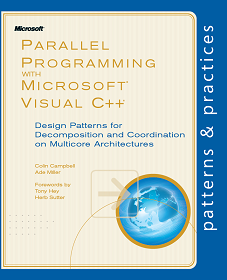

# Parallel Programming with Microsoft Visual C++

**Design Patterns for Decomposition and Coordination on Multicore Architectures**  
Colin Campbell and Ade Miller. Forewords by Tony Hey and Herb Sutter

  A book that introduces C++ programmers to patterns for including parallelism in their applications. Examples of these 
patterns are parallel loops, parallel tasks and data aggregation with map-reduce. Each pattern has its own chapter. 
Each chapter includes a description of the problem, an example of where the pattern is applicable, and code that 
implements the solution. On this site you will find; the accompanying code samples as well as answers to the end 
of chapter questions.

[**Order the hardcopy book or buy the eBook from O’Reilly**](http://oreilly.com/catalog/0790145310507/ "Parallel Programming with Microsoft Visual C++") 

*   $29.99 for the hardcopy, $23.99 for the eBook.

*   Also on Safari Books online and [Amazon.com](http://www.amazon.com/gp/product/0735651752/ref=as_li_tf_tl?ie=UTF8&tag=alpineclimbin-20&linkCode=as2&camp=1789&creative=9325&creativeASIN=0735651752 "Parallel Programming with Microsoft Visual C++").

[**Read the book online in the MSDN Library**](http://msdn.microsoft.com/en-us/library/gg675934.aspx "Parallel Programming with Microsoft Visual C++")

*   Read the book content for free on MSDN!

**[Download the samples for each chapter](http://parallelpatternscpp.codeplex.com/releases/view/60830 "Book Companion Release 1.0")**

The samples are written in C++ and use the [Parallel Patterns Library](http://msdn.microsoft.com/en-us/library/dd492418.aspx "Parallel Patterns Library") and [Asynchronous Agents Library](http://msdn.microsoft.com/en-us/library/dd492627.aspx "Asynchronous Agents Library") that shipped with [Visual Studio 2010](http://www.microsoft.com/visualstudio/en-us/products/2010-editions).

**System Requirements**  

You will need Visual C++ and at least [Visual C++ 2010 Express](http://www.microsoft.com/express/) to run the samples. However, you will need [Visual Studio 2010 Ultimate ](http://www.microsoft.com/visualstudio/en-us/download) to use some the parallel diagnostic tools such as the Concurrency Visualizer.

**Relevant Blogs and Resources**  

Here are some blogs that will keep you up to date with what’s happening with this guide and with parallel programming at Microsoft.

*   [Ade Miller: #2782 ](http://www.ademiller.com/blogs/tech/) - patterns & practices development lead and book author.

*   [Parallel Programming in Native Code](http://blogs.msdn.com/nativeconcurrency/default.aspx) – The native concurrency team’s blog.

*   [Visual C++ Team Blog](http://blogs.msdn.com/b/vcblog/) - The Microsoft Visual C++ team's blog.

*   [Sutter's Mill](http://herbsutter.com/) - Herb Sutter's blog

*   [Patterns and Practices for parallel programming in C++](http://www.microsoft.com/downloads/details.aspx?displaylang=en&FamilyID=0e70b21e-3f10-4635-9af2-e2f7bddba4ae) - A white paper from the native concurrency team.

*   [Code samples for the Concurrency Runtime and Parallel Pattern Library in Visual Studio 2010](http://code.msdn.microsoft.com/concrtextras) – Additional code samples.
